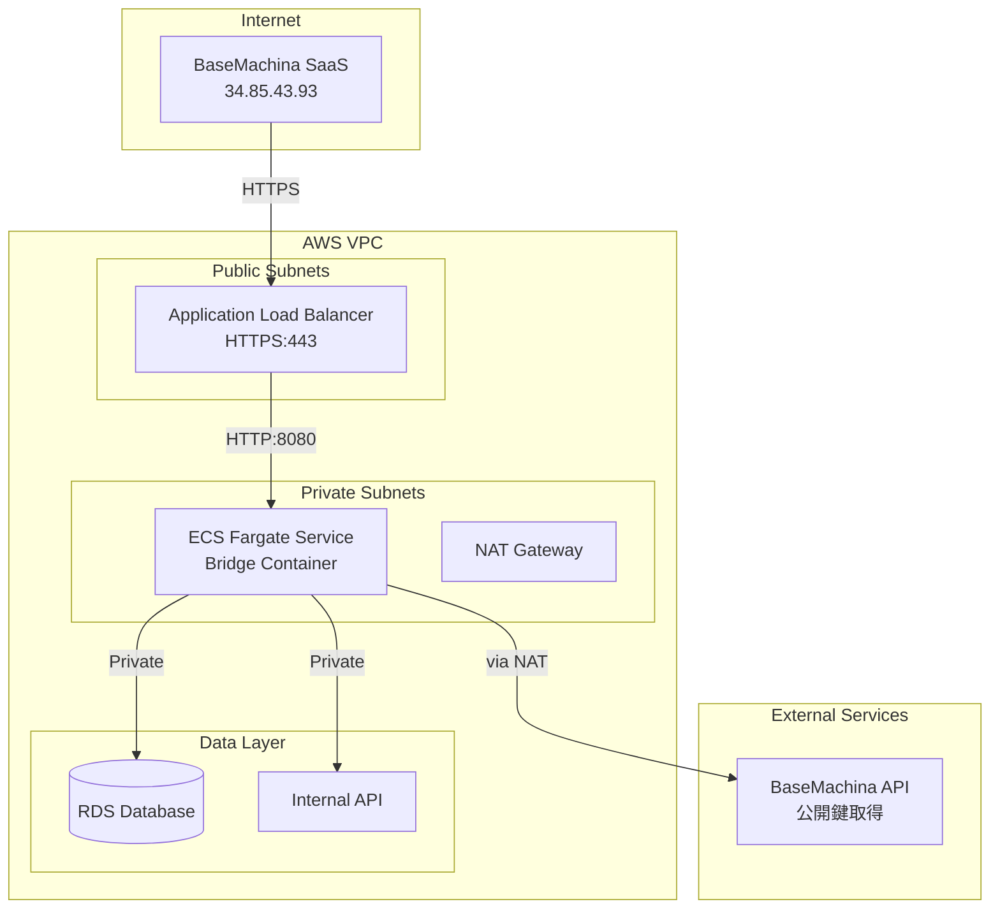
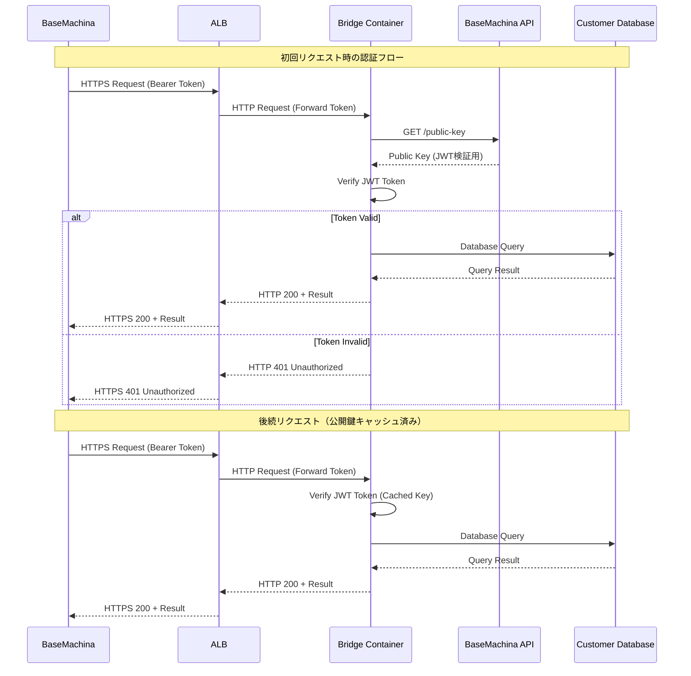
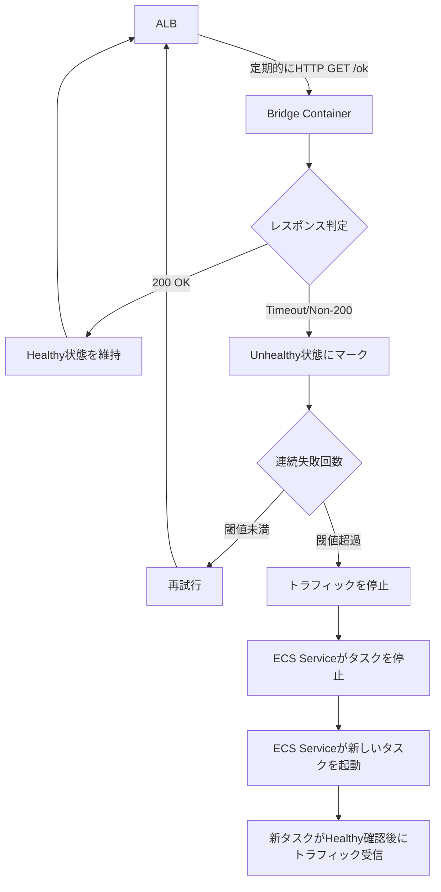

# 技術設計ドキュメント

## Overview

本モジュールは、BaseMachina bridgeをAWS ECS Fargate環境に自動的にデプロイするためのTerraformインフラストラクチャモジュールを提供します。Terraformユーザー、インフラ管理者、セキュリティ管理者は、このモジュールを使用して、BaseMachinaからプライベートデータソース（RDS、内部API等）への安全なアクセスを実現するセキュアなゲートウェイを構築できます。

BaseMachina bridgeは認証機能付きプロキシとして機能し、BaseMachinaのSaaSプラットフォームからお客様のVPC内のリソースへの認証されたアクセスを可能にします。このモジュールは、Infrastructure as Code（IaC）の原則に基づき、再現可能で監査可能なインフラストラクチャのプロビジョニングを実現します。

### Goals

- **再利用可能なTerraformモジュール**: 標準的なモジュール構造に従い、複数のプロジェクトや環境で再利用可能な設計
- **セキュリティベストプラクティス**: プライベートサブネット配置、IPホワイトリスト、最小権限IAMロール、HTTPS通信の強制
- **運用性の確保**: CloudWatch Logsによるログ集約、ALBヘルスチェック、適切なエラーハンドリング
- **拡張性とカスタマイズ性**: 変数による柔軟な設定、タグ付けによるリソース管理、バリデーションによる設定エラーの早期検出

### Non-Goals

- **VPCやサブネットの作成**: 既存のVPCインフラストラクチャを前提とし、モジュール自体はネットワーク基盤を作成しない
- **ACM証明書の管理**: SSL/TLS証明書は事前に作成された証明書ARNを受け取る（証明書のライフサイクル管理は対象外）
- **データベースのプロビジョニング**: 接続先のRDSやその他のデータソースの作成は対象外（セキュリティグループルールの設定のみ）
- **Route 53の自動DNS管理**: ALBのDNS名を出力するが、Route 53レコードの自動作成は行わない
- **マルチリージョンデプロイ**: 単一リージョンでのデプロイのみをサポート（マルチリージョン展開は今後の拡張として検討）

## Architecture

### High-Level Architecture



### Architecture Integration

**既存パターンの保持**:
- Terraformモジュールの標準構造（main.tf、variables.tf、outputs.tf、versions.tf）に準拠
- AWSベストプラクティスに基づくネットワーキング（パブリック/プライベートサブネット分離）
- Infrastructure as Code原則（冪等性、宣言的、バージョン管理）

**新規コンポーネントの根拠**:
- **ECS Fargateクラスター**: サーバーレスコンテナ実行環境として、インフラ管理の負担を最小化
- **Application Load Balancer**: HTTPS終端、ヘルスチェック、トラフィックルーティングを統合的に提供
- **CloudWatch Logsロググループ**: コンテナログの集約と長期保存を実現
- **IAMロール（タスク実行ロール、タスクロール）**: 最小権限の原則に基づいたセキュアな権限管理

**技術スタックの整合性**:
- **Terraform**: プロジェクト全体でInfrastructure as Codeツールとして統一
- **AWS Provider 5.0以上**: 最新のAWSサービス機能とセキュリティ機能へのアクセス
- **公開コンテナイメージ**: `public.ecr.aws/basemachina/bridge`を使用し、バージョン管理された事前ビルドイメージを活用

**ステアリング準拠**:
- **モジュール化原則**: 単一責任（ECS Fargateへのbridge展開のみ）、再利用性、組み合わせ可能性
- **セキュリティファースト**: プライベートサブネット配置、暗号化通信、IPホワイトリスト、最小権限IAM
- **ドキュメント駆動**: 自己文書化コード（変数の説明）、READMEの充実、terraform-docsサポート

## Technology Stack and Design Decisions

本機能は既存のTerraformベースのインフラストラクチャ管理ワークフローに統合される新規モジュールです。

### Technology Alignment

**既存の技術スタックとの整合**:
- **Terraform (1.x系)**: プロジェクト標準のIaCツールを使用
- **AWS Provider (~> 5.0)**: 既存のAWSプロバイダーバージョン要件に準拠
- **標準モジュール構造**: `modules/aws/ecs-fargate/`配下に標準ファイル構成（main.tf、variables.tf、outputs.tf、versions.tf、README.md）

**新規導入される依存関係**:
- **ECS Fargate**: AWS標準のサーバーレスコンテナ実行環境（追加のツールインストール不要）
- **Application Load Balancer (ALB)**: AWS標準のロードバランサー（既存のVPCインフラと統合）
- **CloudWatch Logs**: AWSネイティブのログ管理サービス（追加設定不要）
- **Bridge コンテナイメージ**: `public.ecr.aws/basemachina/bridge`（パブリックレジストリから取得、認証不要）

**パターンからの逸脱**:
なし。すべてのコンポーネントはAWSベストプラクティスとTerraformモジュール設計パターンに準拠しています。

### Key Design Decisions

#### Decision 1: ECS Fargateの採用

**Context**: Bridgeコンテナを実行するためのコンピューティング環境の選択。

**Alternatives**:
- **EC2ベースのECS**: EC2インスタンスを管理する必要があり、パッチ適用、スケーリング、セキュリティ管理の運用負荷が高い
- **EC2上のDocker**: インスタンス管理、ネットワーク設定、ログ集約をすべて手動で構成する必要がある
- **EKS (Kubernetes)**: オーバーヘッドが大きく、単一コンテナアプリケーションには過剰なオーケストレーション

**Selected Approach**: ECS Fargate

Fargateは、タスク定義ベースでコンテナを実行するサーバーレス環境です。タスク定義でCPU、メモリ、環境変数、ネットワーク設定を宣言的に定義し、ECSサービスがdesired_countに基づいて自動的にタスクを維持します。

**Rationale**:
- **サーバーレス運用**: インスタンス管理、パッチ適用、OSセキュリティの管理が不要
- **簡潔なTerraform定義**: タスク定義とサービスの2つのリソースで完結し、モジュールの複雑性を最小化
- **自動スケーリング統合**: ECSサービスのdesired_countベースで容易にスケーリング設定が可能
- **コスト最適化**: 実行中のタスクのみに課金され、アイドル時のインスタンスコストがゼロ

**Trade-offs**:
- **獲得**: 運用負荷の大幅な削減、シンプルなTerraformコード、自動スケーリングの容易性
- **犠牲**: EC2と比較して若干高いコンピューティングコスト、カスタムネットワーク設定の制限

#### Decision 2: ALBによるHTTPS終端とヘルスチェック

**Context**: BaseMachinaからのHTTPS接続を受け付け、Bridgeコンテナへルーティングし、コンテナの健全性を監視する必要がある。

**Alternatives**:
- **NLB (Network Load Balancer)**: L4ロードバランサーでHTTPS終端が不可、証明書管理をBridge側で実装する必要がある
- **API Gateway + VPC Link**: HTTPSエンドポイントを提供できるが、Fargate統合の複雑性が高く、コストが高い
- **Bridgeコンテナ内でHTTPS処理**: 証明書管理、更新、ヘルスチェックをすべてアプリケーションレベルで実装する必要がある

**Selected Approach**: Application Load Balancer (ALB)

ALBをパブリックサブネットに配置し、HTTPS:443でリクエストを受け付け、ACM証明書でTLS終端を行います。ターゲットグループ（タイプ：ip）にFargateタスクを登録し、HTTP:8080でヘルスチェック（`/ok`）を実施します。

**Rationale**:
- **HTTPS終端の統合**: ACM証明書を使用した自動TLS終端、証明書更新の自動化
- **ヘルスチェック機能**: ALBネイティブのヘルスチェックにより、不健全なタスクへのトラフィックを自動的に停止
- **IPホワイトリスト**: セキュリティグループレベルで特定IP（34.85.43.93）からのアクセスのみを許可
- **Fargate統合**: ターゲットタイプ`ip`により、Fargateタスクを直接ターゲットとして登録可能

**Trade-offs**:
- **獲得**: セキュアなHTTPS通信、自動ヘルスチェック、簡潔な証明書管理、IPベースのアクセス制御
- **犠牲**: ALBの追加コスト（時間単位＋データ転送量）、NLBと比較して若干のレイテンシ増加

#### Decision 3: プライベートサブネットへのタスク配置とNAT経由のインターネットアクセス

**Context**: Bridgeタスクは、BaseMachina APIから公開鍵を取得するためにインターネットアクセスが必要だが、セキュリティ要件としてプライベートサブネットに配置する必要がある。

**Alternatives**:
- **パブリックサブネット配置**: パブリックIPを持ち直接インターネットアクセス可能だが、攻撃面が増加し、セキュリティベストプラクティスに反する
- **VPC Endpoint (PrivateLink)**: BaseMachina APIがPrivateLinkをサポートしていないため実現不可
- **インターネットアクセスなし**: 公開鍵の取得ができず、認証機能が動作しない

**Selected Approach**: プライベートサブネット配置 + NAT Gateway経由のアウトバウンドアクセス

Fargateタスクをプライベートサブネットに配置し、セキュリティグループで送信トラフィックを全許可します。プライベートサブネットのルートテーブルは、0.0.0.0/0宛のトラフィックをNATゲートウェイ経由でルーティングします（NATゲートウェイは既存VPCの前提条件）。

**Rationale**:
- **セキュリティベストプラクティス**: プライベートサブネット配置により、インターネットからの直接アクセスを防止
- **アウトバウンドアクセスの確保**: NAT経由でBaseMachina APIへの公開鍵取得リクエストが可能
- **攻撃面の最小化**: インバウンドはALBセキュリティグループからのみ許可し、パブリックIPを持たない

**Trade-offs**:
- **獲得**: セキュアなネットワーク分離、インバウンド攻撃のリスク軽減、セキュリティベストプラクティス準拠
- **犠牲**: NAT Gatewayのコスト（既存VPCの前提条件として受け入れ）、パブリックサブネットと比較してわずかなネットワークホップの増加

## System Flows

### Bridgeリクエスト処理フロー



### ヘルスチェックとタスク復旧フロー



## Requirements Traceability

| Requirement | 概要 | コンポーネント | インターフェース | フロー |
|-------------|------|---------------|----------------|--------|
| 1.1-1.4 | Terraformモジュール構造 | モジュールディレクトリ構造 | `source` パラメータ | - |
| 2.1-2.6 | ECS Fargateクラスターとサービス | ECSクラスター、ECSサービス、タスク定義 | `desired_count`, `cpu`, `memory` 変数 | - |
| 3.1-3.6 | Bridge環境変数 | タスク定義の環境変数 | `fetch_interval`, `fetch_timeout`, `port`, `tenant_id` 変数 | - |
| 4.1-4.7 | ネットワーク構成 | VPC、プライベートサブネット、セキュリティグループ | `vpc_id`, `private_subnet_ids` 変数 | - |
| 5.1-5.10 | ALB構成 | ALB、ターゲットグループ、リスナー、ALBセキュリティグループ | `certificate_arn`, `public_subnet_ids` 変数 | リクエスト処理フロー |
| 6.1-6.6 | IAMロールと権限 | タスク実行ロール、タスクロール、IAMポリシー | IAMロールARN | - |
| 7.1-7.6 | CloudWatch Logs | ロググループ、ログストリーム | `log_retention_days` 変数 | - |
| 8.1-8.4 | データベース接続 | セキュリティグループルール | `database_security_group_id` 変数 | リクエスト処理フロー |
| 9.1-9.3 | 出力値 | Outputs定義 | `alb_dns_name`, `bridge_security_group_id` 等 | - |
| 10.1-10.6 | 変数バリデーション | Variable validationブロック | - | - |
| 11.1-11.5 | タグ付けとリソース命名 | Tags、Name属性 | `tags`, `name_prefix` 変数 | - |
| 12.1-12.4 | 実装例 | `examples/aws-ecs-fargate/` | - | - |
| 13.1-13.4 | モジュールドキュメント | `README.md` | - | - |

## Components and Interfaces

### Infrastructure Layer

#### ECS Cluster

**Responsibility & Boundaries**
- **Primary Responsibility**: ECS Fargateタスクを実行するための論理的なクラスター環境を提供
- **Domain Boundary**: コンテナオーケストレーション層
- **Data Ownership**: クラスターメタデータ、クラスター設定
- **Transaction Boundary**: 該当なし（ステートレスなクラスター定義）

**Dependencies**
- **Inbound**: ECS Service（このクラスター内でサービスを実行）
- **Outbound**: なし
- **External**: なし

**Contract Definition**

**Terraform Resource Interface**:
```hcl
resource "aws_ecs_cluster" "main" {
  name = "${var.name_prefix}-basemachina-bridge"

  setting {
    name  = "containerInsights"
    value = "enabled"
  }

  tags = merge(
    var.tags,
    {
      Name = "${var.name_prefix}-basemachina-bridge"
    }
  )
}
```

- **Preconditions**: なし（新規クラスター作成）
- **Postconditions**: クラスターが`ACTIVE`状態で作成され、Container Insightsが有効化される
- **Invariants**: クラスター名は一意である

#### ECS Service

**Responsibility & Boundaries**
- **Primary Responsibility**: Fargateタスクのライフサイクル管理（desired_countの維持、ALBターゲットグループへの登録、ヘルスチェックベースの自動復旧）
- **Domain Boundary**: コンテナオーケストレーション層
- **Data Ownership**: サービス状態、タスク実行履歴
- **Transaction Boundary**: タスクの起動・停止はアトミックに実行される

**Dependencies**
- **Inbound**: ユーザー（Terraform変数経由でdesired_countを制御）
- **Outbound**: ECSクラスター、タスク定義、ALBターゲットグループ、プライベートサブネット、Bridgeセキュリティグループ
- **External**: なし

**Contract Definition**

**Terraform Resource Interface**:
```hcl
resource "aws_ecs_service" "bridge" {
  name            = "${var.name_prefix}-basemachina-bridge"
  cluster         = aws_ecs_cluster.main.id
  task_definition = aws_ecs_task_definition.bridge.arn
  desired_count   = var.desired_count
  launch_type     = "FARGATE"

  network_configuration {
    subnets          = var.private_subnet_ids
    security_groups  = [aws_security_group.bridge.id]
    assign_public_ip = false
  }

  load_balancer {
    target_group_arn = aws_lb_target_group.bridge.arn
    container_name   = "bridge"
    container_port   = var.port
  }

  depends_on = [aws_lb_listener.https]
}
```

- **Preconditions**: クラスター、タスク定義、ターゲットグループ、HTTPSリスナーが作成済み
- **Postconditions**: desired_count分のタスクが起動し、ALBターゲットグループに登録される
- **Invariants**: 実行中のタスク数はdesired_countに収束する

**State Management**:
- **State Model**: ACTIVE、DRAINING、INACTIVE
- **Persistence**: AWS ECSサービスメタデータ
- **Concurrency**: ECSが自動的にタスクの起動・停止を調整

#### ECS Task Definition

**Responsibility & Boundaries**
- **Primary Responsibility**: Bridgeコンテナの実行仕様を定義（イメージ、CPU、メモリ、環境変数、ログ設定、IAMロール）
- **Domain Boundary**: コンテナ実行環境定義層
- **Data Ownership**: タスク定義メタデータ、コンテナ設定
- **Transaction Boundary**: 該当なし（イミュータブルな定義）

**Dependencies**
- **Inbound**: ECS Service（タスク実行時に参照）
- **Outbound**: タスク実行ロール、タスクロール、CloudWatch Logsロググループ
- **External**: `public.ecr.aws/basemachina/bridge` コンテナイメージ

**External Dependencies Investigation**:

**Bridge Container Image** (`public.ecr.aws/basemachina/bridge`):
- **レジストリ**: Amazon ECR Public（認証不要）
- **イメージタグ**: `latest`を使用（本番環境では特定バージョンタグの使用を推奨）
- **ポート**: 8080（HTTP、環境変数`PORT`でカスタマイズ可能）
- **ヘルスチェックエンドポイント**: `/ok` (HTTP GET)
- **必須環境変数**:
  - `FETCH_INTERVAL`: 公開鍵更新間隔（例: `1h`）
  - `FETCH_TIMEOUT`: 公開鍵取得タイムアウト（例: `10s`）
  - `PORT`: リスニングポート（例: `8080`）
  - `TENANT_ID`: テナントID（認証用）
- **認証メカニズム**: JWT Bearer Tokenを検証、BaseMachina APIから公開鍵を取得
- **ログ出力**: 標準出力（stdout）と標準エラー出力（stderr）

**Contract Definition**

**Terraform Resource Interface**:
```hcl
resource "aws_ecs_task_definition" "bridge" {
  family                   = "${var.name_prefix}-basemachina-bridge"
  network_mode             = "awsvpc"
  requires_compatibilities = ["FARGATE"]
  cpu                      = var.cpu
  memory                   = var.memory
  execution_role_arn       = aws_iam_role.task_execution.arn
  task_role_arn            = aws_iam_role.task.arn

  container_definitions = jsonencode([
    {
      name  = "bridge"
      image = "public.ecr.aws/basemachina/bridge:latest"

      portMappings = [
        {
          containerPort = var.port
          protocol      = "tcp"
        }
      ]

      environment = [
        { name = "FETCH_INTERVAL", value = var.fetch_interval },
        { name = "FETCH_TIMEOUT", value = var.fetch_timeout },
        { name = "PORT", value = tostring(var.port) },
        { name = "TENANT_ID", value = var.tenant_id }
      ]

      logConfiguration = {
        logDriver = "awslogs"
        options = {
          "awslogs-group"         = aws_cloudwatch_log_group.bridge.name
          "awslogs-region"        = data.aws_region.current.name
          "awslogs-stream-prefix" = "bridge"
        }
      }
    }
  ])
}
```

- **Preconditions**: IAMロール、CloudWatch Logsロググループが作成済み
- **Postconditions**: タスク定義がREGISTERED状態となり、ECS Serviceから参照可能
- **Invariants**: タスク定義はイミュータブル（変更時は新リビジョンが作成される）

### Networking Layer

#### Application Load Balancer (ALB)

**Responsibility & Boundaries**
- **Primary Responsibility**: HTTPS終端、トラフィックルーティング、ヘルスチェック、IPベースのアクセス制御
- **Domain Boundary**: トラフィック管理層
- **Data Ownership**: ロードバランサーメトリクス、アクセスログ
- **Transaction Boundary**: 個々のHTTPリクエスト・レスポンス

**Dependencies**
- **Inbound**: BaseMachina SaaS（34.85.43.93）
- **Outbound**: ALBセキュリティグループ、ターゲットグループ、パブリックサブネット
- **External**: ACM証明書（SSL/TLS終端用）

**External Dependencies Investigation**:

**AWS Certificate Manager (ACM) Certificate**:
- **入力**: `certificate_arn`変数（例: `arn:aws:acm:region:account-id:certificate/certificate-id`）
- **前提条件**: ユーザーが事前にACM証明書を作成し、ドメイン検証が完了していること
- **証明書要件**:
  - ドメイン名がALBのDNS名または独自ドメインに対応
  - 有効期限内であること
- **自動更新**: ACM管理の証明書は自動的に更新される（Let's Encrypt等）
- **リスク**: 証明書の有効期限切れ、ドメイン検証の失敗（ACM側で管理、モジュールの責任外）

**Contract Definition**

**Terraform Resource Interface**:
```hcl
resource "aws_lb" "main" {
  name               = "${var.name_prefix}-basemachina-bridge"
  internal           = false
  load_balancer_type = "application"
  security_groups    = [aws_security_group.alb.id]
  subnets            = var.public_subnet_ids

  enable_deletion_protection = false

  tags = merge(
    var.tags,
    {
      Name = "${var.name_prefix}-basemachina-bridge"
    }
  )
}

resource "aws_lb_target_group" "bridge" {
  name        = "${var.name_prefix}-bridge-tg"
  port        = var.port
  protocol    = "HTTP"
  target_type = "ip"
  vpc_id      = var.vpc_id

  health_check {
    enabled             = true
    healthy_threshold   = 2
    unhealthy_threshold = 2
    timeout             = 5
    interval            = 30
    path                = "/ok"
    protocol            = "HTTP"
    matcher             = "200"
  }

  tags = var.tags
}

resource "aws_lb_listener" "https" {
  load_balancer_arn = aws_lb.main.arn
  port              = "443"
  protocol          = "HTTPS"
  ssl_policy        = "ELBSecurityPolicy-TLS-1-2-2017-01"
  certificate_arn   = var.certificate_arn

  default_action {
    type             = "forward"
    target_group_arn = aws_lb_target_group.bridge.arn
  }
}
```

- **Preconditions**: パブリックサブネット、ALBセキュリティグループ、ACM証明書が作成済み
- **Postconditions**: ALBがACTIVE状態となり、HTTPS:443でリクエストを受信可能
- **Invariants**: HTTPS通信はTLS 1.2以上で暗号化される

**Health Check Contract**:
| Method | Path | Expected Response | Interval | Timeout | Healthy Threshold | Unhealthy Threshold |
|--------|------|-------------------|----------|---------|-------------------|---------------------|
| GET | /ok | 200 OK | 30s | 5s | 2回連続成功 | 2回連続失敗 |

#### Security Groups

**Responsibility & Boundaries**
- **Primary Responsibility**: ネットワークレベルのアクセス制御（ALBへのインバウンド制限、BridgeとALB間の通信許可、Bridgeからのアウトバウンド許可）
- **Domain Boundary**: ネットワークセキュリティ層
- **Data Ownership**: セキュリティグループルール
- **Transaction Boundary**: 該当なし（ステートフルファイアウォール）

**Dependencies**
- **Inbound**: ALB、Bridge タスク
- **Outbound**: VPC
- **External**: なし

**Contract Definition**

**ALB Security Group**:
```hcl
resource "aws_security_group" "alb" {
  name_prefix = "${var.name_prefix}-alb-"
  description = "Security group for BaseMachina Bridge ALB"
  vpc_id      = var.vpc_id

  ingress {
    description = "HTTPS from BaseMachina"
    from_port   = 443
    to_port     = 443
    protocol    = "tcp"
    cidr_blocks = ["34.85.43.93/32"]
  }

  egress {
    description = "All outbound traffic"
    from_port   = 0
    to_port     = 0
    protocol    = "-1"
    cidr_blocks = ["0.0.0.0/0"]
  }

  tags = merge(var.tags, {
    Name = "${var.name_prefix}-alb"
  })
}
```

**Bridge Security Group**:
```hcl
resource "aws_security_group" "bridge" {
  name_prefix = "${var.name_prefix}-bridge-"
  description = "Security group for BaseMachina Bridge tasks"
  vpc_id      = var.vpc_id

  ingress {
    description     = "HTTP from ALB"
    from_port       = var.port
    to_port         = var.port
    protocol        = "tcp"
    security_groups = [aws_security_group.alb.id]
  }

  egress {
    description = "All outbound traffic"
    from_port   = 0
    to_port     = 0
    protocol    = "-1"
    cidr_blocks = ["0.0.0.0/0"]
  }

  tags = merge(var.tags, {
    Name = "${var.name_prefix}-bridge"
  })
}
```

**Database Security Group Rule** (オプション):
```hcl
resource "aws_security_group_rule" "database_ingress" {
  count                    = var.database_security_group_id != null ? 1 : 0
  type                     = "ingress"
  from_port                = var.database_port
  to_port                  = var.database_port
  protocol                 = "tcp"
  source_security_group_id = aws_security_group.bridge.id
  security_group_id        = var.database_security_group_id
  description              = "Allow Bridge to access database"
}
```

- **Preconditions**: VPCが作成済み
- **Postconditions**: セキュリティグループが作成され、指定されたルールが適用される
- **Invariants**: ステートフルファイアウォールとして、確立された接続の戻りトラフィックは自動的に許可される

### IAM Layer

#### Task Execution Role

**Responsibility & Boundaries**
- **Primary Responsibility**: ECS Fargateがタスクを起動する際に必要な権限を提供（ECRイメージpull、CloudWatch Logsへの書き込み、Secrets Manager/Parameter Storeへのアクセス）
- **Domain Boundary**: ECSインフラストラクチャ層の権限管理
- **Data Ownership**: IAMロールメタデータ、信頼ポリシー、権限ポリシー
- **Transaction Boundary**: 該当なし（権限チェックは各API呼び出し時に実行）

**Dependencies**
- **Inbound**: ECS Service（タスク起動時に使用）
- **Outbound**: ECR、CloudWatch Logs、Secrets Manager/SSM Parameter Store（オプション）
- **External**: AWS管理ポリシー（`AmazonECSTaskExecutionRolePolicy`）

**Contract Definition**

**Terraform Resource Interface**:
```hcl
resource "aws_iam_role" "task_execution" {
  name_prefix = "${var.name_prefix}-bridge-execution-"

  assume_role_policy = jsonencode({
    Version = "2012-10-17"
    Statement = [
      {
        Action = "sts:AssumeRole"
        Effect = "Allow"
        Principal = {
          Service = "ecs-tasks.amazonaws.com"
        }
      }
    ]
  })

  tags = var.tags
}

resource "aws_iam_role_policy_attachment" "task_execution" {
  role       = aws_iam_role.task_execution.name
  policy_arn = "arn:aws:iam::aws:policy/service-role/AmazonECSTaskExecutionRolePolicy"
}

resource "aws_iam_role_policy" "cloudwatch_logs" {
  name = "cloudwatch-logs"
  role = aws_iam_role.task_execution.id

  policy = jsonencode({
    Version = "2012-10-17"
    Statement = [
      {
        Effect = "Allow"
        Action = [
          "logs:CreateLogStream",
          "logs:PutLogEvents"
        ]
        Resource = "${aws_cloudwatch_log_group.bridge.arn}:*"
      }
    ]
  })
}
```

- **Preconditions**: なし
- **Postconditions**: ロールが作成され、必要なポリシーがアタッチされる
- **Invariants**: `ecs-tasks.amazonaws.com`のみがこのロールをAssumeできる

#### Task Role

**Responsibility & Boundaries**
- **Primary Responsibility**: Bridge コンテナ内のアプリケーションが AWS サービスにアクセスする際の権限を提供（将来的な拡張用、現時点では最小権限）
- **Domain Boundary**: アプリケーション層の権限管理
- **Data Ownership**: IAMロールメタデータ
- **Transaction Boundary**: 該当なし

**Dependencies**
- **Inbound**: Bridgeコンテナ（AWS SDK経由でIAMロールを使用）
- **Outbound**: 将来的にAWSサービスへのアクセス権限を追加
- **External**: なし

**Contract Definition**

**Terraform Resource Interface**:
```hcl
resource "aws_iam_role" "task" {
  name_prefix = "${var.name_prefix}-bridge-task-"

  assume_role_policy = jsonencode({
    Version = "2012-10-17"
    Statement = [
      {
        Action = "sts:AssumeRole"
        Effect = "Allow"
        Principal = {
          Service = "ecs-tasks.amazonaws.com"
        }
      }
    ]
  })

  tags = var.tags
}

# 将来的な拡張用（現時点ではポリシーをアタッチしない）
```

- **Preconditions**: なし
- **Postconditions**: 最小権限のタスクロールが作成される
- **Invariants**: 明示的に許可されない限り、すべてのAWSサービスへのアクセスは拒否される

### Observability Layer

#### CloudWatch Logs

**Responsibility & Boundaries**
- **Primary Responsibility**: Bridgeコンテナの標準出力・標準エラー出力をキャプチャし、長期保存・検索可能な形式で保管
- **Domain Boundary**: ログ集約・管理層
- **Data Ownership**: ログストリーム、ログイベント
- **Transaction Boundary**: ログイベントの書き込みはベストエフォート（非同期）

**Dependencies**
- **Inbound**: Bridgeコンテナ（awslogsログドライバー経由）
- **Outbound**: なし
- **External**: なし

**Contract Definition**

**Terraform Resource Interface**:
```hcl
resource "aws_cloudwatch_log_group" "bridge" {
  name              = "/ecs/basemachina-bridge"
  retention_in_days = var.log_retention_days

  tags = var.tags
}
```

- **Preconditions**: なし
- **Postconditions**: ロググループが作成され、指定された保持期間でログが保存される
- **Invariants**: ログイベントは時系列順に保存される

**Log Schema**:
- **Source**: Bridgeコンテナのstdout/stderr
- **Format**: テキストベース（Bridgeアプリケーションの出力形式に依存）
- **Fields**: タイムスタンプ、ログレベル（アプリケーション依存）、メッセージ
- **Retention**: デフォルト7日間（`log_retention_days`変数でカスタマイズ可能）

## Data Models

本モジュールはインフラストラクチャプロビジョニングを目的としており、アプリケーションレベルのデータモデルは定義しません。以下、Terraformリソースとしてのデータ構造を示します。

### Terraform Input Variables Schema

```hcl
variable "vpc_id" {
  description = "VPC ID where the resources will be created"
  type        = string
}

variable "private_subnet_ids" {
  description = "List of private subnet IDs for ECS tasks"
  type        = list(string)

  validation {
    condition     = length(var.private_subnet_ids) > 0
    error_message = "At least one private subnet must be specified"
  }
}

variable "public_subnet_ids" {
  description = "List of public subnet IDs for ALB"
  type        = list(string)

  validation {
    condition     = length(var.public_subnet_ids) > 0
    error_message = "At least one public subnet must be specified"
  }
}

variable "certificate_arn" {
  description = "ACM certificate ARN for HTTPS listener"
  type        = string
}

variable "fetch_interval" {
  description = "Interval for fetching public keys (e.g., 1h, 30m)"
  type        = string
  default     = "1h"
}

variable "fetch_timeout" {
  description = "Timeout for fetching public keys (e.g., 10s, 30s)"
  type        = string
  default     = "10s"
}

variable "port" {
  description = "Port number for Bridge container (cannot be 4321)"
  type        = number
  default     = 8080

  validation {
    condition     = var.port != 4321
    error_message = "Port 4321 is not allowed"
  }
}

variable "tenant_id" {
  description = "Tenant ID for authentication"
  type        = string
  sensitive   = true
}

variable "cpu" {
  description = "CPU units for ECS task (256, 512, 1024, 2048, 4096)"
  type        = number
  default     = 256

  validation {
    condition     = contains([256, 512, 1024, 2048, 4096], var.cpu)
    error_message = "CPU must be one of: 256, 512, 1024, 2048, 4096"
  }
}

variable "memory" {
  description = "Memory (MiB) for ECS task"
  type        = number
  default     = 512
}

variable "desired_count" {
  description = "Number of ECS tasks to run"
  type        = number
  default     = 1

  validation {
    condition     = var.desired_count >= 1
    error_message = "Desired count must be at least 1"
  }
}

variable "log_retention_days" {
  description = "CloudWatch Logs retention period (days)"
  type        = number
  default     = 7
}

variable "database_security_group_id" {
  description = "Security group ID of the database (optional)"
  type        = string
  default     = null
}

variable "database_port" {
  description = "Database port (e.g., 5432 for PostgreSQL, 3306 for MySQL)"
  type        = number
  default     = 5432
}

variable "tags" {
  description = "Common tags to apply to all resources"
  type        = map(string)
  default     = {}
}

variable "name_prefix" {
  description = "Prefix for resource names"
  type        = string
  default     = ""
}
```

### Terraform Output Values Schema

```hcl
output "alb_dns_name" {
  description = "DNS name of the Application Load Balancer"
  value       = aws_lb.main.dns_name
}

output "alb_arn" {
  description = "ARN of the Application Load Balancer"
  value       = aws_lb.main.arn
}

output "ecs_cluster_name" {
  description = "Name of the ECS cluster"
  value       = aws_ecs_cluster.main.name
}

output "ecs_cluster_arn" {
  description = "ARN of the ECS cluster"
  value       = aws_ecs_cluster.main.arn
}

output "ecs_service_name" {
  description = "Name of the ECS service"
  value       = aws_ecs_service.bridge.name
}

output "bridge_security_group_id" {
  description = "Security group ID of the Bridge tasks"
  value       = aws_security_group.bridge.id
}

output "alb_security_group_id" {
  description = "Security group ID of the ALB"
  value       = aws_security_group.alb.id
}

output "cloudwatch_log_group_name" {
  description = "Name of the CloudWatch Logs log group"
  value       = aws_cloudwatch_log_group.bridge.name
}

output "task_execution_role_arn" {
  description = "ARN of the task execution IAM role"
  value       = aws_iam_role.task_execution.arn
}

output "task_role_arn" {
  description = "ARN of the task IAM role"
  value       = aws_iam_role.task.arn
}
```

## Error Handling

### Error Strategy

TerraformモジュールとしてのエラーハンドリングとBridgeアプリケーションのランタイムエラーハンドリングを分けて定義します。

**Terraformレベルのエラーハンドリング**:
- **変数バリデーション**: `validation`ブロックで無効な入力を事前に検出し、明確なエラーメッセージを提供
- **依存関係の明示**: `depends_on`により、リソース作成順序を保証し、依存関係エラーを防止
- **リソース命名の衝突回避**: `name_prefix`引数を使用し、同一リージョン内での名前衝突を防止

**ランタイムエラーハンドリング（Bridgeアプリケーション）**:
- **ヘルスチェック失敗**: ALBが`/ok`エンドポイントで非200レスポンスを検出した場合、unhealthyとマークし、トラフィックを停止
- **コンテナクラッシュ**: ECS Serviceが自動的に新しいタスクを起動し、desired_countを維持
- **認証エラー**: BridgeがHTTP 401を返し、不正なリクエストを拒否
- **ログ記録**: すべてのエラーはCloudWatch Logsに記録され、トラブルシューティングが可能

### Error Categories and Responses

#### User Errors (Terraform実行時)

**Invalid Input (変数バリデーションエラー)**:
- **エラー例**: `port`が4321、`desired_count`が0、空のサブネットリスト
- **レスポンス**: Terraform planフェーズでバリデーションエラーを表示し、applyを実行前に中止
- **ガイダンス**: エラーメッセージに修正方法を明示（例: "Port 4321 is not allowed. Please use a different port number."）

**Missing Required Variables**:
- **エラー例**: `vpc_id`、`certificate_arn`、`tenant_id`が未指定
- **レスポンス**: "variable X is required"エラーメッセージを表示
- **ガイダンス**: 必須変数の一覧と説明をREADME.mdに明記

**Invalid Resource References**:
- **エラー例**: 存在しないVPC ID、無効な証明書ARN
- **レスポンス**: Terraform applyフェーズでAWS APIエラーを返す
- **ガイダンス**: 変数の説明に正しい形式と前提条件を記載

#### System Errors (AWS Infrastructure)

**Resource Creation Failures**:
- **エラー例**: サービスクォータ超過、IAM権限不足、リソース名の衝突
- **レスポンス**: Terraform applyが失敗し、エラーメッセージを表示
- **回復戦略**: ユーザーがクォータ引き上げ、IAM権限追加、名前変更を実施後、再度`terraform apply`を実行

**Fargate Task Launch Failures**:
- **エラー例**: ECRイメージpull失敗、リソース不足、ネットワーク設定エラー
- **レスポンス**: ECS Serviceがタスク起動を再試行（バックオフ付き）
- **回復戦略**: CloudWatch Logsでエラーを確認し、原因を特定（IAMロール、ネットワーク設定、イメージタグ）

**ALB Health Check Failures**:
- **エラー例**: `/ok`エンドポイントが応答しない、タイムアウト、非200レスポンス
- **レスポンス**: 2回連続失敗後、ターゲットをunhealthyとマークし、トラフィックを停止
- **回復戦略**: ECS Serviceが自動的に新しいタスクを起動し、healthyタスクがトラフィックを受信

#### Business Logic Errors (Bridge Runtime)

**Authentication Failures**:
- **エラー例**: 無効なJWTトークン、期限切れトークン、テナントID不一致
- **レスポンス**: Bridgeが HTTP 401 Unauthorized を返す
- **ガイダンス**: クライアント側で有効なトークンを再取得し、再試行

**Public Key Fetch Failures**:
- **エラー例**: BaseMachina APIへの接続失敗、タイムアウト
- **レスポンス**: Bridgeがエラーログを出力し、次の`FETCH_INTERVAL`で再試行
- **回復戦略**: キャッシュされた公開鍵が有効期間内であれば、一時的にそれを使用（Bridgeの実装に依存）

**Database Connection Failures**:
- **エラー例**: データベースへの接続タイムアウト、認証エラー
- **レスポンス**: Bridgeが HTTP 500 Internal Server Error を返す
- **回復戦略**: データベース接続設定（セキュリティグループ、認証情報）を確認し、修正

### Monitoring

**Terraform State Monitoring**:
- **ツール**: Terraform Cloud、Atlantis、または手動による`terraform plan`の定期実行
- **監視項目**: リソースのドリフト検出、未適用の変更

**Infrastructure Monitoring (CloudWatch)**:
- **ECS Metrics**:
  - CPUUtilization、MemoryUtilization: タスクのリソース使用率
  - DesiredTaskCount、RunningTaskCount: タスク数の監視
- **ALB Metrics**:
  - TargetResponseTime: レスポンス時間
  - HealthyHostCount、UnhealthyHostCount: ターゲットの健全性
  - HTTPCode_Target_5XX_Count: サーバーエラー数
- **Logs**:
  - CloudWatch Logsで`/ecs/basemachina-bridge`ロググループを監視
  - エラーログのフィルタリングとアラート設定

**Alerting**:
- CloudWatch Alarmsで以下の条件でアラートを設定（推奨）:
  - UnhealthyHostCount > 0 が5分間継続
  - HTTPCode_Target_5XX_Count > 閾値
  - ECS Service RunningTaskCount < DesiredTaskCount

## Testing Strategy

### Unit Tests (Terraform Validation)

- **`terraform fmt`**: コードフォーマットの検証（CI/CDパイプラインに統合）
- **`terraform validate`**: Terraform構文の検証（変数参照、リソース依存関係）
- **Variable Validationブロック**: 入力変数のバリデーションロジックをテスト
  - `port != 4321`の検証
  - `desired_count >= 1`の検証
  - サブネットリストが空でないことの検証

### Integration Tests (Terratest)

- **実環境へのデプロイテスト**: Terratest（Go言語）を使用し、実際のAWS環境にモジュールをデプロイ
- **テストケース**:
  - モジュールが正常にapplyされ、すべてのリソースが作成される
  - ALBのDNS名が出力される
  - ECS Serviceがdesired_countのタスクを実行している
  - ALBのヘルスチェックがhealthyである
- **クリーンアップ**: テスト後に`terraform destroy`で全リソースを削除

**Terratest サンプルコード** (`test/aws/ecs_fargate_test.go`):
```go
func TestECSFargateModule(t *testing.T) {
    terraformOptions := terraform.WithDefaultRetryableErrors(t, &terraform.Options{
        TerraformDir: "../../examples/aws-ecs-fargate",
        Vars: map[string]interface{}{
            "vpc_id": "vpc-xxxxx",
            "private_subnet_ids": []string{"subnet-xxxxx", "subnet-yyyyy"},
            "public_subnet_ids": []string{"subnet-aaaaa", "subnet-bbbbb"},
            "certificate_arn": "arn:aws:acm:region:account:certificate/xxxxx",
            "tenant_id": "test-tenant-id",
        },
    })

    defer terraform.Destroy(t, terraformOptions)
    terraform.InitAndApply(t, terraformOptions)

    albDnsName := terraform.Output(t, terraformOptions, "alb_dns_name")
    assert.NotEmpty(t, albDnsName)

    ecsClusterName := terraform.Output(t, terraformOptions, "ecs_cluster_name")
    assert.NotEmpty(t, ecsClusterName)
}
```

### E2E Tests (Manual or Automated)

- **ALBへのHTTPSリクエスト**: curlまたはPostmanでALBのDNS名にHTTPSリクエストを送信
  - 有効なJWTトークンでHTTP 200が返ることを確認
  - 無効なトークンでHTTP 401が返ることを確認
- **ヘルスチェックエンドポイント**: `/ok`エンドポイントがHTTP 200を返すことを確認
- **ログ確認**: CloudWatch Logsで正常なリクエストログとエラーログが記録されていることを確認
- **データベース接続**: Bridgeがデータベースにクエリを実行し、正しい結果を返すことを確認

### Performance/Load Tests

- **同時接続数**: Apache BenchまたはLocustを使用し、100〜1000 req/sの負荷をかける
- **レスポンス時間**: P50、P95、P99レスポンス時間を測定
- **スケーリング**: `desired_count`を増やした場合のパフォーマンス向上を検証
- **ヘルスチェック耐性**: 一部のタスクを手動で停止し、ALBが自動的にトラフィックをrouteすることを確認

## Security Considerations

### Threat Modeling

**攻撃面の分析**:
- **インターネット向けALB**: 34.85.43.93以外からのアクセスをセキュリティグループで遮断
- **Bridgeコンテナ**: プライベートサブネット配置により、直接のインターネットアクセスを防止
- **IAMロール**: 最小権限の原則に基づき、必要な権限のみを付与

**主要な脅威**:
1. **不正アクセス**: IPホワイトリスト外からのHTTPSリクエスト
   - **緩和策**: ALBセキュリティグループで34.85.43.93/32のみを許可
2. **認証バイパス**: 無効なトークンでのアクセス試行
   - **緩和策**: Bridge側でJWT検証を実施、無効なトークンを拒否
3. **DDoS攻撃**: 大量のリクエストによるリソース枯渇
   - **緩和策**: AWS Shield Standard（自動有効）、必要に応じてShield Advancedを検討
4. **データ漏洩**: ログやメトリクスからの機密情報漏洩
   - **緩和策**: CloudWatch Logsのアクセス制御、機密情報のログ出力を避ける（Bridgeアプリケーション側）
5. **IAM権限の悪用**: 過剰な権限によるリソースへの不正アクセス
   - **緩和策**: タスク実行ロールとタスクロールを分離、必要最小限の権限のみを付与

### Security Controls

**Network Security**:
- **プライベートサブネット配置**: Bridgeタスクはプライベートサブネットに配置し、パブリックIPを持たない
- **セキュリティグループ**: ALBとBridge間のトラフィックのみを許可、データベースへのアクセスも最小限に制限
- **NAT Gateway**: インターネットへのアウトバウンド通信はNAT経由に制限

**Data Protection**:
- **転送中の暗号化**: HTTPS通信（TLS 1.2以上）を強制、ACM証明書を使用
- **保存時の暗号化**: CloudWatch LogsはAWS管理のKMSキーで自動的に暗号化（オプションでカスタマーマネージドキーを使用可能）
- **機密情報の管理**: `tenant_id`はTerraform変数の`sensitive = true`でマスク、Secrets Manager統合を推奨（将来的な拡張）

**Access Control**:
- **IAMロールベースのアクセス**: EC2インスタンスプロファイルやユーザーベースの認証ではなく、タスクロールを使用
- **最小権限の原則**: タスク実行ロールはECRとCloudWatch Logsのみ、タスクロールは現時点で追加権限なし

**Compliance**:
- **AWS Well-Architected Framework**: セキュリティの柱に準拠（最小権限、多層防御、暗号化）
- **監査ログ**: CloudWatch LogsとAWS CloudTrailでAPI呼び出しを記録
- **定期的なレビュー**: IAMロール、セキュリティグループルールの定期的な見直し

### Authentication and Authorization

**Bridge Authentication Flow**:
1. BaseMachinaがHTTPSリクエストにJWT Bearer Tokenを含めて送信
2. ALBがHTTPSを終端し、トークンを含むHTTPリクエストをBridgeにフォワード
3. BridgeがBaseMachina APIから公開鍵を取得（初回または更新間隔ごと）
4. BridgeがJWTトークンを検証（署名、有効期限、テナントID）
5. 検証成功時、データベースクエリを実行し結果を返す
6. 検証失敗時、HTTP 401を返す

**Authorization Model**:
- **テナント分離**: `TENANT_ID`環境変数により、特定のテナントからのリクエストのみを受け付け
- **データベースレベルの認可**: Bridgeがデータベース接続時の認証情報を使用（モジュールの責任外、前提条件として提供）

## Performance & Scalability

### Target Metrics

- **レスポンス時間**: P95 < 500ms（ALBからBridgeまで、データベースクエリ時間を除く）
- **スループット**: 単一タスクあたり100 req/s、複数タスクで水平スケーリング
- **可用性**: 99.9%（ALBとECS Serviceの自動復旧機能により達成）

### Scaling Approaches

**水平スケーリング（Horizontal Scaling）**:
- **手動スケーリング**: `desired_count`変数を増やし、`terraform apply`を実行
- **自動スケーリング** (将来的な拡張):
  - ECS Service Auto Scalingを使用し、CPUUtilizationやALBリクエスト数に基づいてスケール
  - Target Tracking Scaling Policyで、平均CPUUtilization 70%を維持

**垂直スケーリング（Vertical Scaling）**:
- **CPU/メモリの増加**: `cpu`と`memory`変数を増やし、`terraform apply`を実行
- **制約**: Fargateの制約により、CPUとメモリの組み合わせは限定的（AWS公式ドキュメント参照）

### Caching Strategies

**公開鍵のキャッシング**:
- Bridgeが`FETCH_INTERVAL`（デフォルト1時間）ごとにBaseMachina APIから公開鍵を取得
- キャッシュ期間中はローカルで検証し、外部APIコールを削減

**データベースクエリのキャッシング**:
- モジュールの責任外（Bridgeアプリケーションまたはデータベース側で実装）

**ALBのConnection Pooling**:
- ALBがターゲットへの接続をプールし、接続確立のオーバーヘッドを削減
