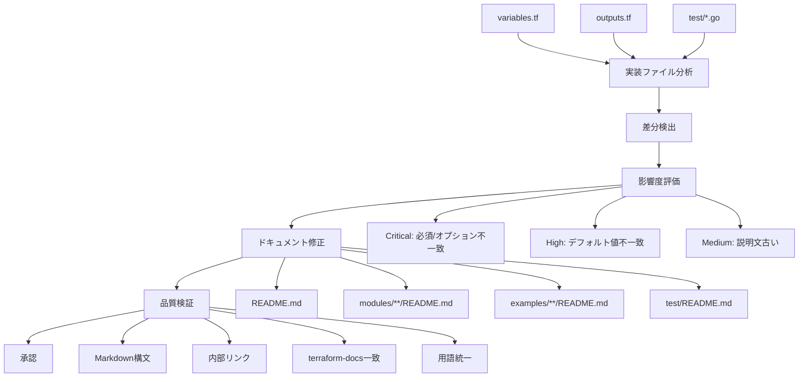
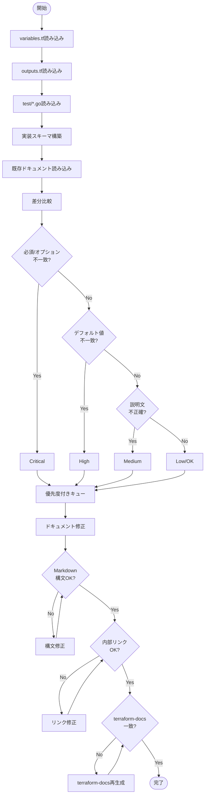
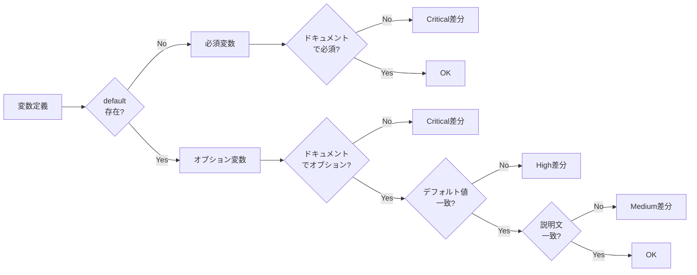
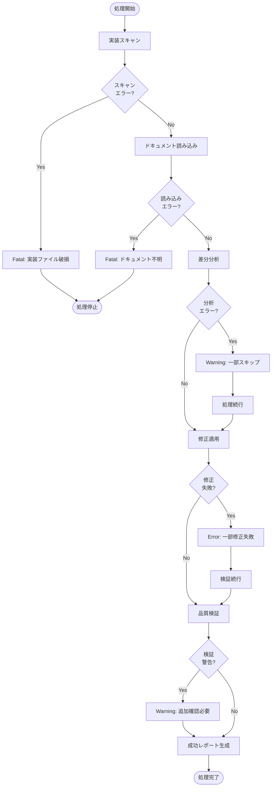
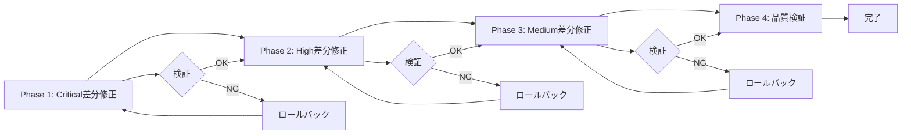

# 技術設計書

## 概要

このドキュメント整合化プロジェクトは、BaseMachina Bridge Terraform Modulesのドキュメントを実装と完全に一致させることを目的とします。AWS ECS FargateとGCP Cloud Runの両モジュールが実装完了していますが、以下の不整合が発見されています：

1. **必須/オプションパラメータの不一致**: variables.tfでは必須（defaultなし）だが、ドキュメントではオプション扱い
2. **ネットワーク構成の説明不足**: VPCエンドポイント、NAT Gateway、Direct VPC Egressの動作と必須要件が不明確
3. **テスト手順の不完全性**: 環境変数リスト、実行時間見積もり、クリーンアップ手順が不足

**ユーザー**: Terraformモジュール利用者（開発者、DevOpsエンジニア）、テスト実行者、新規貢献者

**影響**: 既存のドキュメントファイル（README.md、モジュールREADME、exampleのREADME、test/README.md）を修正。実装コードは変更しない。

### ゴール

- 全ドキュメントが実装と100%一致する
- 必須/オプションパラメータが明確に記載される
- ネットワーク構成（VPCエンドポイント、NAT Gateway等）の動作が理解できる
- テスト手順が完全で実行可能である

### 非ゴール

- 実装コード（*.tf、*.go）の変更
- 新機能の追加
- ドキュメント構造の大幅な変更（既存の章立てを維持）
- 翻訳やローカライゼーション

## アーキテクチャ

### 既存アーキテクチャの分析

このプロジェクトは既存のドキュメント構造を尊重し、以下のパターンを維持します：

- **terraform-docs統合**: `BEGIN_TF_DOCS`～`END_TF_DOCS`セクションは自動生成されるため、手動編集は避ける
- **ディレクトリ別README**: ルート、modules/、examples/、test/の各階層にREADMEが存在し、それぞれ異なる読者を対象とする
- **HCL使用例**: すべてのREADMEにTerraform HCL形式の使用例が含まれる
- **日英混在**: 技術用語は英語、説明文は日本語という一貫したスタイル

### ドキュメント整合化プロセス



### 技術整合性

このドキュメント修正プロジェクトは、以下の既存プロジェクト原則を維持します：

- **IaCファースト**: Terraformによるインフラ定義を正確に文書化
- **マルチクラウド対応**: AWS、GCPの両方を平等に扱う
- **セキュリティファースト**: HTTPS必須、IPホワイトリスト、NAT Gateway要件を明確化
- **テスト可能性**: Terratestによる統合テストの実行手順を正確に記載

### ステアリング準拠

- **structure.md**: ディレクトリ構造とファイル命名規則に従ったドキュメント配置
- **tech.md**: 技術スタック（Terraform、AWS Provider、Google Provider）の正確な記載
- **product.md**: プロダクト価値提案とユースケースの一貫した説明

## システムフロー

### ドキュメント整合化ワークフロー



### 差分検出アルゴリズム



## 要件トレーサビリティ

| 要件 | 要件概要 | コンポーネント | 処理フロー | 検証方法 |
|------|----------|--------------|----------|---------|
| 1.1-1.6 | 実装コード調査 | 実装スキャナー | 実装ファイル読み込み → スキーマ構築 | 全variables.tf/outputs.tf読み込み確認 |
| 2.1-2.10 | 差分検出 | 差分アナライザー | ドキュメント比較 → 影響度評価 | Critical/High/Medium/Low分類 |
| 3.1-3.7 | AWS ECS Fargateドキュメント修正 | ドキュメント修正エンジン | 差分適用 → 検証 | modules/aws/ecs-fargate/README.md更新 |
| 4.1-4.7 | GCP Cloud Runドキュメント修正 | ドキュメント修正エンジン | 差分適用 → 検証 | modules/gcp/cloud-run/README.md更新 |
| 5.1-5.7 | テストドキュメント修正 | ドキュメント修正エンジン | 差分適用 → 検証 | test/README.md更新 |
| 6.1-6.7 | Exampleドキュメント修正 | ドキュメント修正エンジン | 差分適用 → 検証 | examples/**/README.md更新 |
| 7.1-7.6 | ルートREADME修正 | ドキュメント修正エンジン | 差分適用 → 検証 | README.md更新 |
| 8.1-8.7 | 品質検証 | 品質検証エンジン | 構文/リンク/terraform-docs検証 | 自動チェック合格 |

## コンポーネントと契約

### ドキュメント整合化システム

#### 実装スキャナー

**責任と境界**
- **主要責任**: 実装ファイル（variables.tf、outputs.tf、test/*.go）を読み込み、正規化されたスキーマを構築する
- **ドメイン境界**: 実装ファイルの解析のみ。ドキュメント読み込みは担当しない
- **データ所有権**: 実装スキーマ（変数定義、出力定義、テスト環境変数）

**依存関係**
- **インバウンド**: 差分アナライザー
- **アウトバウンド**: ファイルシステム（Read tool）
- **外部依存**: なし

**契約定義**

```typescript
interface ImplementationScanner {
  scanVariables(modulePath: string): Result<VariableSchema[], ScanError>;
  scanOutputs(modulePath: string): Result<OutputSchema[], ScanError>;
  scanTestEnvVars(testPath: string): Result<EnvVarSchema[], ScanError>;
}

interface VariableSchema {
  name: string;
  type: string;
  description: string;
  required: boolean;  // default が存在しない場合 true
  defaultValue: string | null;
  validation: ValidationRule[];
}

interface OutputSchema {
  name: string;
  description: string;
  sensitive: boolean;
}

interface EnvVarSchema {
  name: string;
  required: boolean;
  description: string;
  example: string | null;
}

type ScanError =
  | { type: 'FileNotFound'; path: string }
  | { type: 'ParseError'; path: string; message: string };
```

- **事前条件**: modulePath/testPathが有効なディレクトリパス
- **事後条件**: 全変数/出力/環境変数が正確に抽出される
- **不変条件**: 同じファイルを複数回スキャンしても同じ結果を返す

#### 差分アナライザー

**責任と境界**
- **主要責任**: 実装スキーマとドキュメント記載内容を比較し、不整合を検出して影響度を評価する
- **ドメイン境界**: 差分検出と評価のみ。修正提案は行わない
- **データ所有権**: 差分レポート（不整合箇所、影響度、詳細）

**依存関係**
- **インバウンド**: ドキュメント修正エンジン
- **アウトバウンド**: 実装スキャナー、ドキュメントリーダー
- **外部依存**: なし

**契約定義**

```typescript
interface DifferenceAnalyzer {
  analyzeModule(
    modulePath: string,
    readmePath: string
  ): Result<DifferenceReport, AnalysisError>;

  analyzeTest(
    testPath: string,
    testReadmePath: string
  ): Result<DifferenceReport, AnalysisError>;
}

interface DifferenceReport {
  differences: Difference[];
  summary: {
    critical: number;
    high: number;
    medium: number;
    low: number;
  };
}

interface Difference {
  type: 'RequiredMismatch' | 'DefaultValueMismatch' | 'DescriptionOutdated' | 'MissingVariable';
  severity: 'Critical' | 'High' | 'Medium' | 'Low';
  location: {
    file: string;
    section: string;
    line: number | null;
  };
  expected: string;  // 実装に基づく正しい値
  actual: string;    // ドキュメント記載の値
  suggestedFix: string;
}

type AnalysisError =
  | { type: 'ScanFailed'; error: ScanError }
  | { type: 'DocumentParseError'; path: string; message: string };
```

- **事前条件**: 実装スキーマが正常にスキャンされている
- **事後条件**: 全不整合が影響度付きで報告される
- **不変条件**: 影響度評価ルールは一貫している（必須/オプション不一致 → Critical）

#### ドキュメント修正エンジン

**責任と境界**
- **主要責任**: 差分レポートに基づいてドキュメントを修正し、terraform-docs生成セクションを尊重する
- **ドメイン境界**: ドキュメント修正のみ。実装コードは変更しない
- **データ所有権**: 修正後のドキュメント内容

**依存関係**
- **インバウンド**: 品質検証エンジン
- **アウトバウンド**: 差分アナライザー、ファイルシステム（Edit tool）
- **外部依存**: terraform-docs（オプション、BEGIN_TF_DOCS検証用）

**契約定義**

```typescript
interface DocumentationFixEngine {
  applyFixes(
    readmePath: string,
    differences: Difference[]
  ): Result<FixReport, FixError>;

  regenerateTerraformDocs(
    modulePath: string
  ): Result<string, TerraformDocsError>;
}

interface FixReport {
  fixedDifferences: Difference[];
  skippedDifferences: Difference[];  // terraform-docs管理領域の変更はスキップ
  modifiedSections: string[];
}

type FixError =
  | { type: 'FileNotWritable'; path: string }
  | { type: 'InvalidMarkdown'; path: string; message: string }
  | { type: 'TerraformDocsConflict'; section: string };

type TerraformDocsError =
  | { type: 'CommandNotFound' }
  | { type: 'GenerationFailed'; stderr: string };
```

- **事前条件**: 差分レポートが生成されている
- **事後条件**: Critical/High差分が修正される、terraform-docs管理領域は保護される
- **不変条件**: 既存のドキュメント構造（章立て、順序）を維持する

#### 品質検証エンジン

**責任と境界**
- **主要責任**: 修正後のドキュメントの品質を検証する（Markdown構文、内部リンク、terraform-docs一致、用語統一）
- **ドメイン境界**: 検証のみ。自動修正は最小限（構文エラーのみ）
- **データ所有権**: 検証レポート

**依存関係**
- **インバウンド**: なし（最終段階）
- **アウトバウンド**: ドキュメント修正エンジン、ファイルシステム
- **外部依存**: terraform-docs（オプション）

**契約定義**

```typescript
interface QualityValidator {
  validateMarkdown(readmePath: string): Result<ValidationReport, ValidationError>;
  validateInternalLinks(rootPath: string): Result<LinkReport, ValidationError>;
  validateTerraformDocs(modulePath: string): Result<TFDocsReport, ValidationError>;
  validateTerminology(readmePath: string): Result<TermReport, ValidationError>;
}

interface ValidationReport {
  valid: boolean;
  errors: ValidationIssue[];
  warnings: ValidationIssue[];
}

interface ValidationIssue {
  file: string;
  line: number;
  column: number;
  message: string;
  severity: 'Error' | 'Warning';
}

interface LinkReport {
  brokenLinks: Array<{
    source: string;
    target: string;
    line: number;
  }>;
  externalLinks: Array<{
    source: string;
    url: string;
    accessible: boolean;
  }>;
}

interface TFDocsReport {
  modulePath: string;
  consistent: boolean;
  mismatches: Array<{
    section: 'inputs' | 'outputs' | 'requirements' | 'providers';
    expected: string;
    actual: string;
  }>;
}

interface TermReport {
  inconsistencies: Array<{
    term: string;
    variations: string[];
    locations: Array<{ file: string; line: number }>;
  }>;
  suggestedStandard: string;
}

type ValidationError =
  | { type: 'FileNotReadable'; path: string }
  | { type: 'ParserError'; path: string; message: string };
```

- **事前条件**: ドキュメントが修正されている
- **事後条件**: 全品質基準が合格またはエラーレポート生成
- **不変条件**: 検証は冪等（何度実行しても同じ結果）

## データモデル

### 実装スキーマモデル

このプロジェクトでは、実装ファイルから抽出された情報を正規化されたデータモデルで表現します。

```typescript
// 変数定義スキーマ
interface VariableDefinition {
  name: string;                    // 変数名（例: "certificate_arn"）
  type: TerraformType;             // 型（string, number, list(string), map(string)等）
  description: string;             // 説明文
  required: boolean;               // 必須フラグ（default が存在しない場合 true）
  defaultValue: string | null;     // デフォルト値（存在しない場合 null）
  validation: ValidationRule[];    // バリデーションルール
  sensitive: boolean;              // 機密情報フラグ
}

type TerraformType =
  | 'string'
  | 'number'
  | 'bool'
  | { list: TerraformType }
  | { map: TerraformType }
  | { object: Record<string, TerraformType> };

interface ValidationRule {
  condition: string;    // Terraform条件式
  errorMessage: string; // エラーメッセージ
}

// 出力定義スキーマ
interface OutputDefinition {
  name: string;          // 出力名（例: "alb_dns_name"）
  description: string;   // 説明文
  value: string;         // 出力値の式（参照のみ、評価しない）
  sensitive: boolean;    // 機密情報フラグ
}

// テスト環境変数スキーマ
interface TestEnvVariable {
  name: string;          // 環境変数名（例: "TEST_VPC_ID"）
  required: boolean;     // 必須フラグ
  description: string;   // 説明文
  example: string | null;// 設定例
  usedInTest: string[];  // 使用されるテストファイル
}

// モジュールスキーマ（集約）
interface ModuleSchema {
  modulePath: string;
  variables: VariableDefinition[];
  outputs: OutputDefinition[];
  testEnvVars: TestEnvVariable[];
  provider: 'aws' | 'gcp';
}
```

### ドキュメント差分モデル

```typescript
// 差分の種類
type DifferenceType =
  | 'RequiredMismatch'      // 必須/オプション不一致
  | 'DefaultValueMismatch'  // デフォルト値不一致
  | 'DescriptionOutdated'   // 説明文が古い
  | 'MissingVariable'       // ドキュメントに変数記載なし
  | 'ExtraVariable'         // 実装に存在しない変数がドキュメントに記載
  | 'TypeMismatch'          // 型の不一致
  | 'ValidationMissing';    // バリデーションルールの記載漏れ

// 影響度
type Severity = 'Critical' | 'High' | 'Medium' | 'Low';

// 差分レコード
interface DifferenceRecord {
  id: string;                  // ユニークID（修正追跡用）
  type: DifferenceType;
  severity: Severity;
  location: DocumentLocation;
  expected: string;            // 実装に基づく正しい値
  actual: string;              // ドキュメント記載の値
  suggestedFix: string;        // 修正提案
  autoFixable: boolean;        // 自動修正可能フラグ
}

interface DocumentLocation {
  file: string;                // ファイルパス
  section: string;             // セクション名（例: "## 入力変数"）
  line: number | null;         // 行番号（特定できる場合）
  variableName: string | null; // 対象変数名
}

// 差分レポート
interface DifferenceReport {
  modulePath: string;
  documentPath: string;
  timestamp: string;
  differences: DifferenceRecord[];
  summary: {
    critical: number;
    high: number;
    medium: number;
    low: number;
    autoFixableCount: number;
  };
}
```

### ドキュメント修正モデル

```typescript
// 修正アクション
interface FixAction {
  differenceId: string;        // 対象差分のID
  action: 'Replace' | 'Insert' | 'Delete' | 'RegenerateTerraformDocs';
  location: DocumentLocation;
  oldContent: string | null;   // 置換前の内容
  newContent: string;          // 置換後の内容
  applied: boolean;            // 適用済みフラグ
  result: FixResult | null;
}

type FixResult =
  | { status: 'Success' }
  | { status: 'Skipped'; reason: string }
  | { status: 'Failed'; error: string };

// 修正レポート
interface FixReport {
  documentPath: string;
  timestamp: string;
  actions: FixAction[];
  summary: {
    appliedCount: number;
    skippedCount: number;
    failedCount: number;
  };
  modifiedSections: string[];  // 修正されたセクション名
}
```

## エラーハンドリング

### エラー戦略

ドキュメント整合化プロセスでは、以下のエラー処理戦略を採用します：

1. **実装スキャンエラー**: 致命的エラー。処理を停止し、ユーザーに実装ファイルの問題を報告
2. **ドキュメント読み込みエラー**: 致命的エラー。処理を停止し、ドキュメントファイルのアクセス問題を報告
3. **差分検出エラー**: 継続可能。エラーが発生したファイルをスキップし、他のファイルを処理
4. **修正適用エラー**: 継続可能。失敗した修正をログに記録し、次の修正を試行
5. **品質検証エラー**: 警告として報告。修正は完了しているが、追加の手動確認が必要

### エラーカテゴリと対応

#### ユーザーエラー（4xx相当）

- **無効な入力**: 存在しないモジュールパスを指定
  - **対応**: エラーメッセージで正しいパスを提案（例: `modules/aws/ecs-fargate`）

- **権限不足**: ドキュメントファイルへの書き込み権限がない
  - **対応**: ファイルパスとパーミッションを表示し、`chmod`コマンドを提案

#### システムエラー（5xx相当）

- **実装ファイル破損**: variables.tfの構文エラー
  - **対応**: `terraform validate`実行を提案、エラー箇所を特定

- **ファイルシステムエラー**: ディスク容量不足、ファイルロック
  - **対応**: エラー詳細を表示し、システム管理者に連絡するよう指示

#### ビジネスロジックエラー（422相当）

- **terraform-docs競合**: BEGIN_TF_DOCS領域に手動編集を検出
  - **対応**: 警告を表示し、`terraform-docs`再生成を提案

- **リンク切れ検出**: 内部リンクの参照先が存在しない
  - **対応**: 修正候補（似た名前のファイル）を提案

### エラーフロー



### モニタリング

#### エラー追跡

- **ログ出力**: 全エラー、警告を構造化ログとして出力（JSON形式）
- **エラー統計**: 処理終了時に集計レポート（Fatal/Error/Warning件数）
- **トレースID**: 各実行に一意なIDを付与し、エラー追跡を容易に

#### ヘルスモニタリング

- **処理時間**: 実装スキャン、差分分析、修正適用、品質検証の各段階の実行時間を計測
- **ファイル処理数**: 処理対象ファイル数と成功/失敗数をカウント
- **差分統計**: Critical/High/Medium/Low差分の件数を記録

## テスト戦略

### ユニットテスト

#### 実装スキャナー
1. **変数抽出の正確性**: variables.tfから全変数を正しく抽出できる
2. **必須/オプション判定**: `default`の有無で正しく判定できる
3. **バリデーションルール抽出**: validation ブロックを正確に解析できる
4. **型推論**: Terraform型（string、list(string)、map(string)等）を正しく認識できる
5. **エラーハンドリング**: 存在しないファイルパスで適切なエラーを返す

#### 差分アナライザー
1. **必須/オプション不一致検出**: 実装は必須だがドキュメントでオプション扱いの場合にCriticalを返す
2. **デフォルト値不一致検出**: デフォルト値が異なる場合にHighを返す
3. **説明文不一致検出**: 説明文が古い場合にMediumを返す
4. **変数名完全一致**: 大文字小文字を区別して変数名を比較する
5. **影響度評価の一貫性**: 同じ不整合パターンに対して常に同じ影響度を返す

#### ドキュメント修正エンジン
1. **terraform-docs領域保護**: BEGIN_TF_DOCS～END_TF_DOCSセクションを修正しない
2. **既存構造維持**: 章立て、セクション順序を変更しない
3. **Markdown構文保持**: コードブロック、リンク、テーブルの構文を壊さない
4. **複数差分の統合**: 同一ファイルの複数差分を一度に修正できる
5. **ロールバック可能性**: 修正前のバックアップを保持する

#### 品質検証エンジン
1. **Markdown構文検証**: 不正なコードブロック、リンク構文を検出できる
2. **内部リンク検証**: 存在しないファイルへのリンクを検出できる
3. **terraform-docs一致性**: BEGIN_TF_DOCS内容が実装と一致することを確認できる
4. **用語統一検証**: "NAT Gateway"、"VPCエンドポイント"等の表記揺れを検出できる

### 統合テスト

#### エンドツーエンドテスト
1. **AWS ECS Fargateモジュール完全フロー**: variables.tf読み込み → 差分検出 → modules/aws/ecs-fargate/README.md修正 → 検証
2. **GCP Cloud Runモジュール完全フロー**: variables.tf読み込み → 差分検出 → modules/gcp/cloud-run/README.md修正 → 検証
3. **テストドキュメント完全フロー**: test/*.go読み込み → 環境変数抽出 → test/README.md修正 → 検証
4. **ルートREADME完全フロー**: 全モジュール分析 → README.md修正 → リンク検証
5. **多段階修正**: Critical差分修正 → High差分修正 → 検証を順次実行

#### 差分検出の実データテスト
1. **certificate_arn必須検出**: AWS ECS Fargateモジュールで`certificate_arn`が必須であることを検出
2. **domain_name必須検出**: AWS ECS Fargateモジュールで`domain_name`、`route53_zone_id`が必須であることを検出
3. **allowed_ip_rangesデフォルト検出**: GCP Cloud Runモジュールで`allowed_ip_ranges`のデフォルト動作を検出
4. **vpc_network_id条件付き必須検出**: GCP Cloud RunモジュールでDirect VPC Egress使用時に`vpc_network_id`が必須であることを検出
5. **テスト環境変数完全抽出**: test/aws/ecs_fargate_test.goから全環境変数（TEST_VPC_ID、TEST_PRIVATE_SUBNET_IDS等）を抽出

### パフォーマンステスト

#### 処理時間目標
1. **実装スキャン**: 全モジュール（AWS、GCP）で5秒以内
2. **差分分析**: 全ドキュメント（6ファイル）で10秒以内
3. **修正適用**: 全ドキュメントで15秒以内
4. **品質検証**: 全ドキュメントで10秒以内
5. **完全フロー**: 合計40秒以内

#### スケーラビリティ
1. **大規模モジュール**: 50個以上の変数を持つモジュールでも処理時間が2倍を超えない
2. **並列処理**: 複数モジュールの差分分析を並列実行できる
3. **メモリ使用量**: 全ドキュメント処理でメモリ使用量が500MB以下

## オプションセクション

### セキュリティ考慮事項

このドキュメント整合化プロジェクトでは、以下のセキュリティリスクに対処します：

#### 機密情報の取り扱い

- **リスク**: variables.tfに`sensitive = true`が設定された変数の値がドキュメントに誤って記載される
- **対策**:
  - 実装スキャナーで`sensitive`フラグを検出
  - ドキュメント修正時に機密変数の値例を`[REDACTED]`に置換
  - 品質検証エンジンでドキュメント内の機密情報パターン（API key、password等）をスキャン

#### ドキュメントインジェクション

- **リスク**: variables.tfの説明文にMarkdownインジェクション攻撃が含まれる（例: ``）
- **対策**:
  - 説明文をサニタイズ（Markdownリンク、スクリプトタグをエスケープ）
  - 外部リンクに`rel="noopener noreferrer"`を自動追加（該当する場合）

#### ファイルシステムアクセス

- **リスク**: パストラバーサル攻撃（`../../../etc/passwd`等）
- **対策**:
  - 全ファイルパスをプロジェクトルートからの相対パスに正規化
  - プロジェクトディレクトリ外へのアクセスを禁止

### マイグレーション戦略

このプロジェクトは既存ドキュメントの修正のため、マイグレーションは不要です。ただし、以下の段階的アプローチを推奨します：



#### Phase 1: Critical差分修正（必須パラメータ）

- **対象**: `certificate_arn`、`domain_name`、`route53_zone_id`等の必須/オプション不一致
- **検証ポイント**: terraform validateが成功する、使用例が動作する
- **ロールバック条件**: 構文エラー、terraform validate失敗

#### Phase 2: High差分修正（デフォルト値）

- **対象**: デフォルト値の不一致
- **検証ポイント**: 全変数のデフォルト値がvariables.tfと一致
- **ロールバック条件**: デフォルト値の型エラー

#### Phase 3: Medium差分修正（説明文）

- **対象**: 説明文が古い、不正確な記載
- **検証ポイント**: 説明文が実装の動作を正確に反映
- **ロールバック条件**: 説明文が誤解を招く内容に変更された

#### Phase 4: 品質検証

- **対象**: Markdown構文、内部リンク、terraform-docs一致、用語統一
- **検証ポイント**: 全品質基準が合格
- **完了条件**: 警告ゼロ、全自動テスト合格
