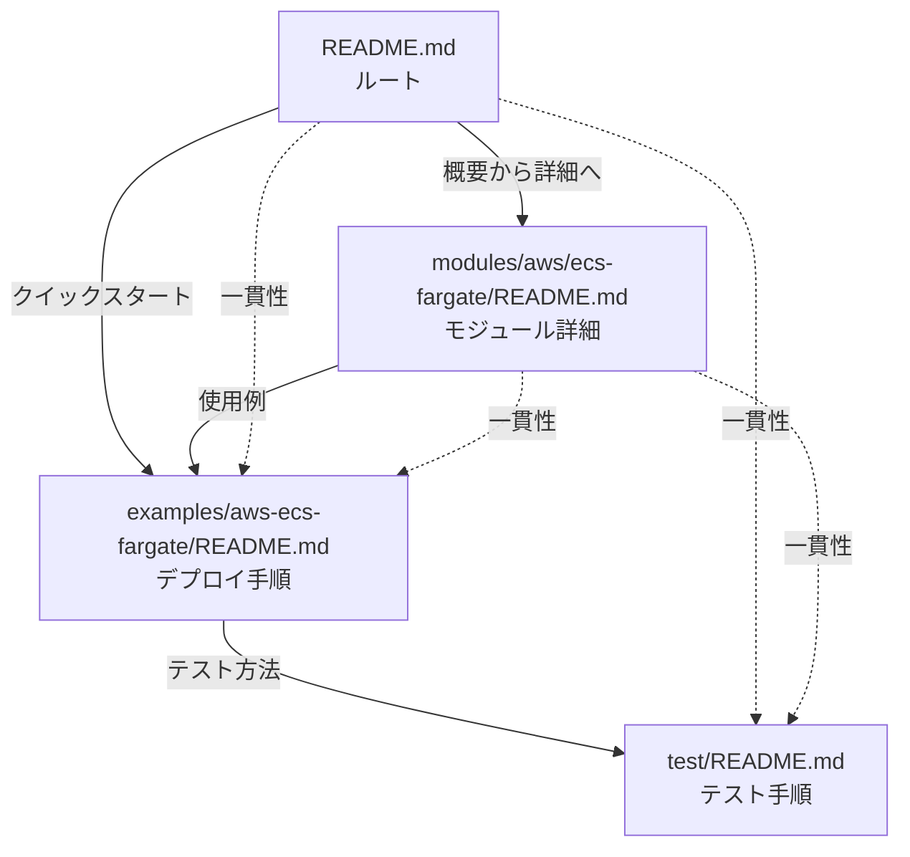
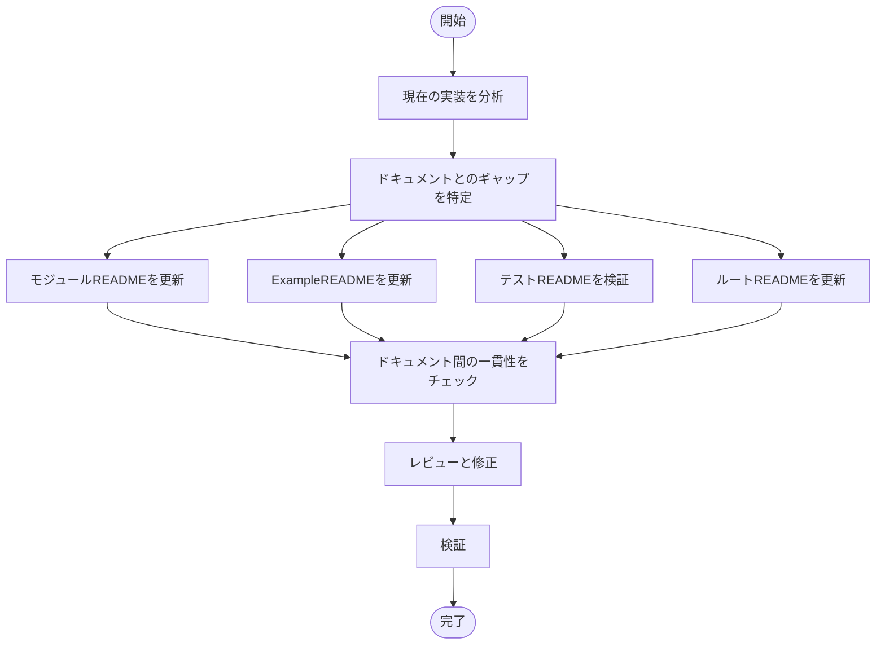
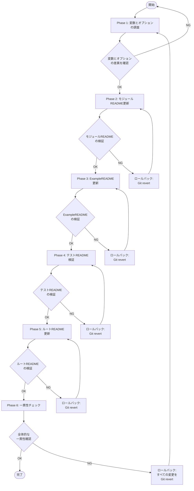

# 技術設計ドキュメント

## Overview

このドキュメント更新プロジェクトは、BaseMachina Terraform Modulesプロジェクトの全READMEファイルを、現在の実装（Route53統合、DNS検証によるACM証明書発行、複数の証明書オプション、テスト強化など）に合わせて正確かつ包括的に更新します。

最近の実装変更により、ドキュメントと実装の間に複数のギャップが生じています。主なギャップは以下の通りです：
- モジュールREADMEで`domain_name`と`route53_zone_id`が必須変数として明記されていない
- ExampleREADMEでDNS検証による証明書発行の説明が不足
- 証明書オプション（DNS検証、自己署名、既存証明書、HTTP）の説明が不完全
- テストREADMEは既に統合済みで最新（test/README.mdに統合完了）

ターゲットユーザーは、モジュール利用者、Example利用者、テスト実行者、プロジェクト初見者です。これらのユーザーが、最新の機能と正確な使用方法を理解し、予期しないエラーを回避できるようにします。

### Goals

- モジュールREADME（modules/aws/ecs-fargate/README.md）を現在の実装と完全に一致させる
- ExampleREADME（examples/aws-ecs-fargate/README.md）のデプロイ手順、オプション、前提条件を最新化する
- テストREADME（test/README.md）の環境変数、テスト手順、実行時間を確認し、必要に応じて修正する
- ルートREADME（README.md）のプロジェクト概要と主要機能を最新の実装に反映する
- 全READMEファイル間で用語、オプション名、説明の一貫性を確保する

### Non-Goals

- 実装コードの変更（ドキュメントのみを更新）
- 新機能の追加（既存機能の正確な説明のみ）
- ドキュメント構造の大幅な変更（既存の構造を尊重）

## Architecture

### Existing Architecture Analysis

現在のドキュメント構造は、以下の4層の階層で構成されています：

1. **ルートREADME（README.md）**: プロジェクト全体の概要、主要機能、クイックスタート
2. **モジュールREADME（modules/aws/ecs-fargate/README.md）**: モジュールの詳細、変数、使用例
3. **ExampleREADME（examples/aws-ecs-fargate/README.md）**: デプロイ手順、前提条件、トラブルシューティング
4. **テストREADME（test/README.md）**: テスト手順、環境変数、実行時間

この構造は、ユーザーの学習パスに沿っており、プロジェクト初見者からモジュール利用者、テスト実行者まで、段階的に詳細な情報を提供しています。この構造は変更せず、内容のみを更新します。

### High-Level Architecture

**Architecture Integration**:
- **既存パターンの保持**: 4層の階層構造を維持し、各READMEの役割を尊重
- **新コンポーネントの根拠**: 新しいコンポーネントはなし（既存ドキュメントの更新のみ）
- **技術スタックとの整合**: Markdown形式、既存のセクション構造を維持
- **ステアリング準拠**: structure.mdで定義されたドキュメント構造パターンに従う

### Technology Alignment

この機能は既存のドキュメントシステムの拡張であり、新しい技術は導入しません。

**既存技術スタックとの整合**:
- **ドキュメント形式**: Markdown（既存と同じ）
- **ドキュメント生成**: 手動編集（terraform-docsは使用しない）
- **バージョン管理**: Git（既存と同じ）

**新しい依存関係**: なし

**既存パターンからの逸脱**: なし

## System Flows

### Documentation Update Process Flow

## Requirements Traceability

| Requirement | Requirement Summary | Components | Sections | Validation |
|-------------|---------------------|------------|----------|------------|
| 1.1-1.5 | モジュールドキュメントの正確性 | modules/aws/ecs-fargate/README.md | 入力変数、使用例、ドメイン設定、証明書オプション、ネットワーク要件 | variables.tfとの照合 |
| 2.1-2.5 | Exampleドキュメントの完全性 | examples/aws-ecs-fargate/README.md | 前提条件、デプロイ手順、証明書設定、RDS統合、トラブルシューティング | 実装ファイルとの照合 |
| 3.1-3.5 | テストドキュメントの正確性 | test/README.md | 環境変数、テスト実行コマンド、実行時間、トラブルシューティング、テスト内容 | テストコードとの照合 |
| 4.1-4.4 | プロジェクトルートドキュメントの概要性 | README.md | プロジェクト概要、主要機能、クイックスタート、ディレクトリ構造 | 全体的な整合性チェック |
| 5.1-5.4 | ドキュメント間の一貫性 | 全READMEファイル | 変数名、証明書オプション、ネットワーク構成、コマンド例 | クロスリファレンスチェック |
| 6.1-6.2 | 変更履歴とバージョン情報（オプション） | 全READMEファイル | 変更履歴セクション、バージョン情報 | 手動レビュー |

## Components and Interfaces

### Documentation Components

#### ルートREADME（README.md）

**Responsibility & Boundaries**
- **Primary Responsibility**: プロジェクト全体の概要を提供し、初見者がプロジェクトの目的と主要機能を素早く理解できるようにする
- **Domain Boundary**: プロジェクトレベルの情報（詳細はモジュールREADMEやExampleREADMEに委譲）
- **Data Ownership**: プロジェクト概要、主要機能リスト、ディレクトリ構造の説明

**Dependencies**
- **Inbound**: なし（トップレベルのドキュメント）
- **Outbound**: modules/aws/ecs-fargate/README.md、examples/aws-ecs-fargate/README.mdへのリンク
- **External**: なし

**Contract Definition**

**Content Contract**:

必須セクション：
1. **プロジェクト概要**: BaseMachina Bridge Terraform Modulesの目的と主要なユースケース
2. **主要機能**: 最新の実装を反映した機能リスト
   - Route53統合によるDNS管理
   - DNS検証によるACM証明書の自動発行
   - 複数の証明書オプション（DNS検証、自己署名、既存証明書、HTTP）
   - VPCエンドポイント + NAT Gatewayのハイブリッド構成
   - Terratestによる包括的な統合テスト
3. **クイックスタート**: examples/aws-ecs-fargateへの明確なリンクと基本的なステップ
4. **ディレクトリ構造**（オプション）: modules/、examples/、test/ディレクトリの役割

**Consistency Requirements**:
- モジュールREADMEとExampleREADMEで使用されている用語と一貫性を保つ
- 証明書オプションの名称は「DNS検証」「自己署名証明書」「既存証明書」「HTTP」で統一

#### モジュールREADME（modules/aws/ecs-fargate/README.md）

**Responsibility & Boundaries**
- **Primary Responsibility**: モジュールの詳細な仕様、入力変数、出力値、使用例を提供し、モジュール利用者が正しく使用できるようにする
- **Domain Boundary**: モジュールレベルの情報（デプロイ手順はExampleREADMEに委譲）
- **Data Ownership**: 入力変数の完全なリスト、出力値、モジュールの使用例

**Dependencies**
- **Inbound**: README.md（ルート）からのリンク
- **Outbound**: examples/aws-ecs-fargate/README.mdへのリンク
- **External**: modules/aws/ecs-fargate/variables.tf（変数定義の情報源）

**Contract Definition**

**Content Contract**:

必須セクション：
1. **モジュール概要**: モジュールの目的と主な機能
2. **使用方法**: 基本的な使用例（HCLコード）
   - 必須変数を含む完全な例：
     - `certificate_arn`（必須）
     - `domain_name`と`route53_zone_id`（Route53統合用、必須）
     - その他のネットワーク関連変数
3. **要件**: Terraformバージョン、プロバイダーバージョン、前提条件
4. **入力変数**: variables.tfに定義されているすべての入力変数を正確に記載
5. **ドメイン設定**: Route53 Hosted Zoneとの統合方法を説明
6. **証明書オプション**: 4つの証明書設定パターンを明確に説明
   - DNS検証によるACM証明書自動発行（推奨）
   - 自己署名証明書のACMインポート
   - 既存のACM証明書の利用
   - HTTPのみの構成（非推奨）
7. **ネットワーク要件**: NAT Gateway、VPCエンドポイント、ECRプルスルーキャッシュの役割と設定

**Data Integrity**:
- variables.tfとの完全な一致を保証
- 変数名、型、デフォルト値、説明の正確性

**Consistency Requirements**:
- ExampleREADMEで使用されている変数名と説明と一貫性を保つ
- ルートREADMEで言及されている機能と整合性を保つ

#### ExampleREADME（examples/aws-ecs-fargate/README.md）

**Responsibility & Boundaries**
- **Primary Responsibility**: デプロイ手順、前提条件、トラブルシューティングを提供し、Example利用者がスムーズにBridgeをデプロイできるようにする
- **Domain Boundary**: Exampleレベルの情報（モジュールの詳細はモジュールREADMEに委譲）
- **Data Ownership**: デプロイ手順、前提条件、トラブルシューティングガイド

**Dependencies**
- **Inbound**: README.md（ルート）、modules/aws/ecs-fargate/README.mdからのリンク
- **Outbound**: test/README.mdへのリンク（オプション）
- **External**: examples/aws-ecs-fargate/*.tf（実装ファイル）

**Contract Definition**

**Content Contract**:

必須セクション：
1. **前提条件**: 以下のリソースの必要性を説明
   - VPCとサブネット（パブリック・プライベート）
   - Route53 Hosted Zone（DNS検証を使用する場合、必須）
   - BaseMachinaテナントID
   - AWS認証情報
2. **デプロイ手順**: 以下のステップを含む
   - terraform.tfvarsの設定（bridge_domain_nameとroute53_zone_idを含む）
   - terraform init、plan、applyの実行
   - DNS検証待機時間（5-15分）の説明
   - デプロイ後の確認方法
3. **証明書設定**: 3つの証明書オプションの設定方法を説明
   - DNS検証による自動発行（bridge_domain_nameとroute53_zone_idの設定）
   - 自己署名証明書（enable_acm_import = trueの設定）
   - 既存のACM証明書（certificate_arnの設定）
4. **RDS統合**（オプション）: RDS variables（database_username、database_passwordなど）の設定方法とBastion hostの使用方法を説明
5. **トラブルシューティング**: 以下の一般的な問題の解決方法を提供
   - ACM証明書のDNS検証が完了しない
   - ECSタスクが起動しない
   - ALBヘルスチェックが失敗する

**Consistency Requirements**:
- モジュールREADMEで説明されている変数と一貫性を保つ
- テストREADMEで説明されている環境変数と整合性を保つ
- 証明書オプションの用語は「DNS検証」「自己署名証明書」「既存証明書」で統一

#### テストREADME（test/README.md）

**Responsibility & Boundaries**
- **Primary Responsibility**: テスト手順、環境変数、実行時間を提供し、テスト実行者が正しくテストを実行できるようにする
- **Domain Boundary**: テストレベルの情報
- **Data Ownership**: テスト手順、環境変数リスト、テスト内容

**Dependencies**
- **Inbound**: examples/aws-ecs-fargate/README.mdからのリンク（オプション）
- **Outbound**: なし
- **External**: test/aws/ecs_fargate_test.go（テストコード）

**Contract Definition**

**Content Contract**:

必須セクション：
1. **環境変数**: 以下の環境変数を正確に記載
   - TEST_VPC_ID、TEST_PRIVATE_SUBNET_IDS、TEST_PUBLIC_SUBNET_IDS（必須）
   - TEST_TENANT_ID（必須）
   - TEST_BRIDGE_DOMAIN_NAME、TEST_ROUTE53_ZONE_ID（DNS検証オプション）
   - TEST_ENABLE_ACM_IMPORT（自己署名証明書オプション）
   - TEST_CERTIFICATE_ARN（既存証明書オプション）
2. **テスト実行コマンド**: 正しいタイムアウト値（60m）を含むコマンド例
3. **実行時間**: DNS検証を使用する場合の所要時間（15-20分）を記載
4. **トラブルシューティング**: ACM証明書のDNS検証問題の診断方法（diagnose-dns-validation.shスクリプトの使用）を説明
5. **テスト内容**: 以下のテスト項目を記載
   - Route53 Hosted Zoneの存在確認（DNS検証使用時）
   - ACM証明書のDNS検証（最大15分タイムアウト）
   - ECSタスクの起動確認
   - ALBヘルスチェック
   - HTTPS エンドポイントの疎通確認

**Validation**:
- 環境変数名とテストコード（test/aws/ecs_fargate_test.go）との一致を確認
- タイムアウト値とコマンド例の正確性を確認

**Note**: test/README.mdはtest/aws/README.mdの内容を既に統合済みで、最新の状態です。このドキュメントは検証のみ行い、必要に応じて最小限の修正を加えます。

## Testing Strategy

### Documentation Verification Tests

#### 変数整合性テスト（Unit Tests）
- **modules/aws/ecs-fargate/README.md**: variables.tfに定義されているすべての変数が正確に記載されているか確認
- **examples/aws-ecs-fargate/README.md**: 使用されている変数名がモジュールREADMEと一致しているか確認
- **test/README.md**: 環境変数名がテストコード（ecs_fargate_test.go）と一致しているか確認

#### 内容正確性テスト（Integration Tests）
- **モジュールREADME**: 使用例のHCLコードが実際に動作するか、必須変数が含まれているか確認
- **ExampleREADME**: デプロイ手順が実際の手順と一致しているか確認
- **テストREADME**: テスト実行コマンドが実際に動作するか、タイムアウト値が適切か確認

#### 一貫性テスト（Cross-Reference Tests）
- 全READMEファイル間で以下の一貫性を確認：
  - 変数名と説明の一致
  - 証明書オプションの用語統一（「DNS検証」「自己署名証明書」「既存証明書」「HTTP」）
  - ネットワーク構成の説明統一（NAT Gateway、VPCエンドポイント、ECRプルスルーキャッシュ）
  - コマンド例のフォーマット統一

#### リンク検証テスト（Link Validation）
- 全READMEファイル内のリンクが正しく機能するか確認
- 相対パスリンクが正しいか確認
- 外部リンク（AWS公式ドキュメント等）が有効か確認

## Migration Strategy

### 段階的更新プロセス

### Phase Breakdown

**Phase 1: 変数とオプションの調査**
- 実行内容：
  - modules/aws/ecs-fargate/variables.tfを読み込み、すべての変数をリストアップ
  - examples/aws-ecs-fargate/*.tfファイルを読み込み、使用されている変数を確認
  - test/aws/ecs_fargate_test.goを読み込み、使用されている環境変数を確認
- 検証チェックポイント：
  - 変数リストが完全であること
  - 現在のドキュメントとの差異が特定されていること
- ロールバックトリガー：
  - 変数リストに漏れがある場合、調査を再実行

**Phase 2: モジュールREADME更新**
- 実行内容：
  - modules/aws/ecs-fargate/README.mdを更新
  - 入力変数セクションをvariables.tfと一致させる
  - 使用例を最新の必須変数を含む形に更新
  - ドメイン設定セクションを追加
  - 証明書オプションセクションを更新
  - ネットワーク要件セクションを更新
- 検証チェックポイント：
  - variables.tfとの完全な一致
  - 使用例が動作すること（HCL構文チェック）
  - 必須変数がすべて含まれていること
- ロールバックトリガー：
  - 検証チェックポイントのいずれかが失敗した場合、git revertで戻す

**Phase 3: ExampleREADME更新**
- 実行内容：
  - examples/aws-ecs-fargate/README.mdを更新
  - 前提条件セクションにRoute53 Hosted Zoneを追加
  - デプロイ手順セクションにDNS検証待機時間を追加
  - 証明書設定セクションを3つのオプションに分けて説明
  - RDS統合セクションを追加（オプション）
  - トラブルシューティングセクションを更新
- 検証チェックポイント：
  - モジュールREADMEとの一貫性
  - デプロイ手順の正確性
  - トラブルシューティングガイドの有用性
- ロールバックトリガー：
  - 検証チェックポイントのいずれかが失敗した場合、git revertで戻す

**Phase 4: テストREADME検証**
- 実行内容：
  - test/README.mdを検証
  - 環境変数リストがテストコードと一致しているか確認
  - テスト実行コマンドのタイムアウト値が正しいか確認
  - 実行時間の記載が正確か確認
  - トラブルシューティングセクションが最新か確認
  - 必要に応じて最小限の修正を加える
- 検証チェックポイント：
  - テストコードとの一致
  - コマンド例が動作すること
  - タイムアウト値が適切であること
- ロールバックトリガー：
  - 検証チェックポイントのいずれかが失敗した場合、git revertで戻す

**Phase 5: ルートREADME更新**
- 実行内容：
  - README.mdを更新
  - 主要機能リストを最新の実装に反映
  - クイックスタートセクションをexamples/への明確なリンクに更新
  - ディレクトリ構造セクションを追加（オプション）
- 検証チェックポイント：
  - モジュールREADMEとExampleREADMEとの一貫性
  - 主要機能が最新の実装を反映していること
  - リンクが正しく機能すること
- ロールバックトリガー：
  - 検証チェックポイントのいずれかが失敗した場合、git revertで戻す

**Phase 6: 一貫性チェック**
- 実行内容：
  - 全READMEファイル間で以下の一貫性を確認：
    - 変数名と説明の一致
    - 証明書オプションの用語統一
    - ネットワーク構成の説明統一
    - コマンド例のフォーマット統一
  - クロスリファレンスリンクの検証
  - 外部リンクの有効性確認
- 検証チェックポイント：
  - すべてのドキュメント間で用語が統一されていること
  - リンクがすべて正しく機能すること
  - 説明に矛盾がないこと
- ロールバックトリガー：
  - 一貫性の問題が発見された場合、すべての変更をgit revertで戻し、Phase 1から再開

### Rollback Triggers

各フェーズで以下のトリガーに該当する場合、ロールバックを実行：
- 検証チェックポイントの失敗
- 手動レビューでの重大な問題の発見
- ドキュメント間の一貫性の欠如

ロールバック手順：
1. `git revert <commit-hash>`で該当フェーズの変更を戻す
2. 問題を修正
3. 該当フェーズを再実行

### Validation Checkpoints

各フェーズ完了時に以下を確認：
- **Phase 1**: 変数リストの完全性
- **Phase 2**: variables.tfとの一致、使用例の動作確認
- **Phase 3**: モジュールREADMEとの一貫性、デプロイ手順の正確性
- **Phase 4**: テストコードとの一致、コマンド例の動作確認
- **Phase 5**: 全体的な一貫性、リンクの有効性
- **Phase 6**: ドキュメント間のクロスチェック、最終レビュー

## Security Considerations

このドキュメント更新プロジェクトは、コードの変更を伴わないため、セキュリティリスクは最小限です。ただし、以下の点に注意が必要です：

**機密情報の漏洩リスク**:
- ドキュメント例に機密情報（実際のテナントID、証明書ARN、VPC IDなど）を含めない
- プレースホルダー値（例: `your-tenant-id`、`vpc-xxxxx`）を使用
- terraform.tfvars.exampleファイルにも実際の値を含めない

**セキュリティベストプラクティスの説明**:
- HTTPS通信の推奨を明確に記載
- HTTPのみの構成は非推奨であることを明記
- IPホワイトリスト（34.85.43.93/32）の重要性を説明
- NAT Gatewayの必須性を強調（Public ECRアクセスのため）
